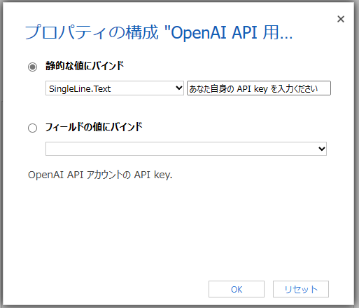

# OpenAI GPT Assisted Column のインストールおよび構成方法

[English is here](./SettingUp.md)

## 前提条件

- OpenAI のアカウントをお持ちであること。API key を取得するのに必要です。
- あなたがカスタマイズできる Dataverse 環境をお持ちであること。
- モデル駆動型アプリをお持ちであること。

## インストールおよび構成

1. ソリューションのインストール

    この PCF コントロールを含むソリューション ファイルを Dataverse あるいは Dynamics 365 環境にインストールします。  
    最新のマネージド ソリューション ファイル (.zip) は [こちらのレポジトリ](https://github.com/keijiinouehotmail/OpenAIGPTAssistedColumnPCF/releases) からダウンロードできます。

1. 列の作成

    このステップは、適用可能な列をお持ちの場合には任意となりますが、推奨されるものです。  

    - お望みのテーブルにて、以下のような新しい列を作成します。

        - **データの種類** は "複数行テキスト" を指定します。
        - **書式** は "テキスト" を指定します。
        - **最大文字数** を増やしてもよいです。

        

1. 列の追加

    - Power Apps の フォーム デザイナーにて、作成した列をモデル駆動型アプリのフォームに追加します。

1. PCF コントロールの構成
    1. Power Apps のクラシック フォーム デザイナーを表示します
    1. 上記で追加したフィールド (あるいは 列) をダブルうkリックして、"フィールドのプロパティ" ダイアログを表示します
    1. "コントロール" タブをクリックします
    1. "コントロールの追加..." リンクをクリックします
    1. 下にスクロールして "**OpenAIGPTAssistedColumn**" を見つけて、それをクリックします

        

    1. "追加" ボタンをクリックします
    1. 用途に合わせて Web、電話、タブレット をオンにします

        

    1. 3つ、あるいは4つのプロパティを設定します:
        1. **キーワード**

            これは後の 尋ねる文章 で使用されるキーワードのためのものです。  
            お望みのフィールドの値にバインドします。例えば、**name** ("取引先企業名" 列) です。

            

        1. **尋ねる文章**

            これは、GPT への質問文章のためのものです。  
            既定の値を、お望みのものに変更して頂けます。  
            プレースホルダーとして ${} を使って、上記で設定した **キーワード** フィールドの値を差し込むことができます。

            - 既定値: "What is strengths of **${}** as a company?"
            - 例えばこのように変更: "企業としての **${}** の強みは何ですか？"
            - GPT への質問文章はこのようになります: "企業としての **マイクロソフト** の強みは何ですか？"、これはキーワードが取引先企業テーブルの "name" が設定されていて、その値が "マイクロソフト" である場合の例です。

            

        1. **OpenAI API の API key**

            これはあなたの OpenAI アカウントの OpenAI API のための API key です。  
            Azure OpenAI サービスを利用している場合にはスキップしてください。  
            以下のページで API Key を生成できます。  
                <https://platform.openai.com/account/api-keys>  

            

        1. **Azure OpenAI リソースの API key**

            これはあなたの Azure OpenAI リソースの API key です。  
            Azure portal で Azure OpenAI リソースを表示してリソース管理の中の キーとエンドポイント ブレードにて key を表示できます。  

            

        1. **Azure OpenAI リソース の gpt-35-turbo モデルのエンドポイント URL**

            Azure OpenAI API リソースの gpt-35-turbo モデルのエンドポイント URL を入力してください。  
            以下のような文字列です。{リソースの名前} と {モデル デプロイメントの名前} を適時変更ください。  

            ```text
            https://{リソースの名前}.openai.azure.com/openai/deployments/{モデル デプロイメントの名前}/completions?api-version=2022-12-01
            ```

            

        1. ここまでで、すべてのプロパティの設定が完了しました

    1. "表示" タブにて、"**フォームでラベルを表示する**" をオフに設定できます

        

    1. "OK" ボタンをクリックして、"フィールドのプロパティ" ダイアログを閉じます
    1. フォームを**保存** して、**公開**します

1. モデル駆動型アプリであなたがコントロールを追加したフォームを開き、コントロールの挙動をチェックします
