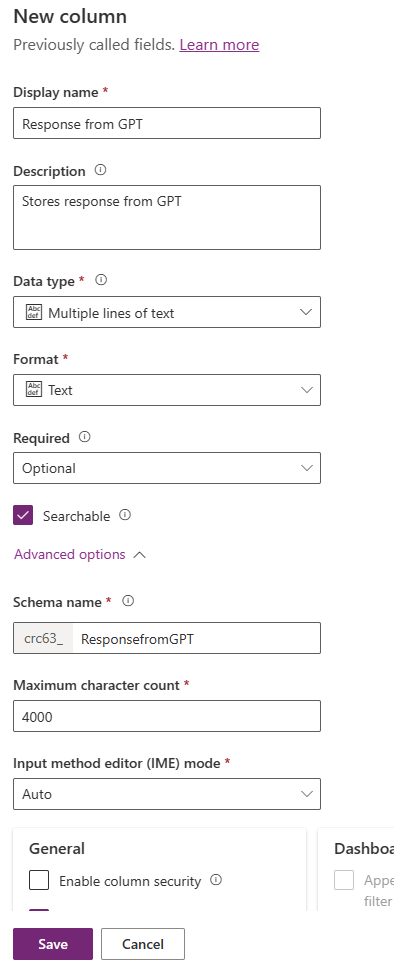
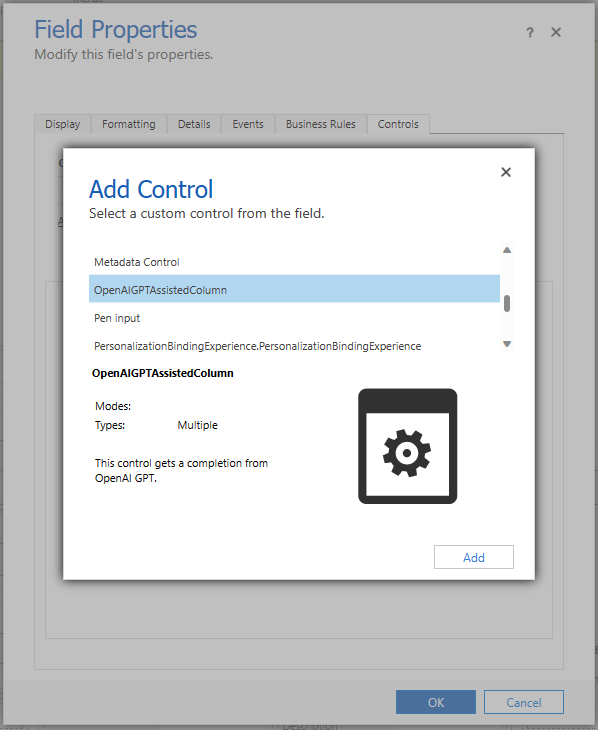
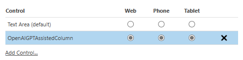
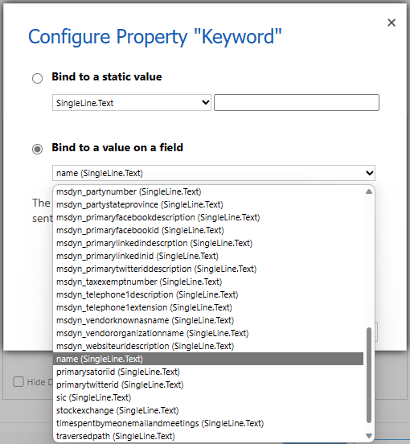
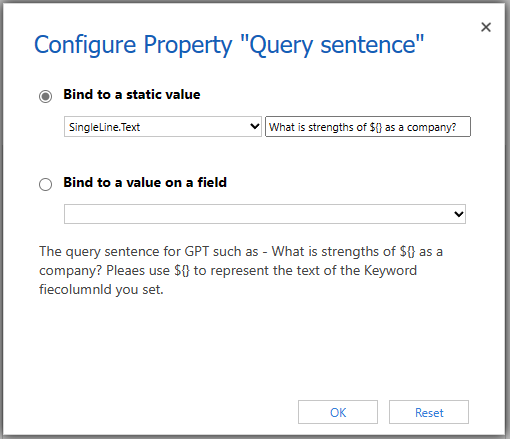
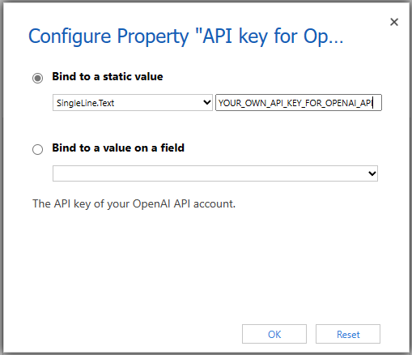
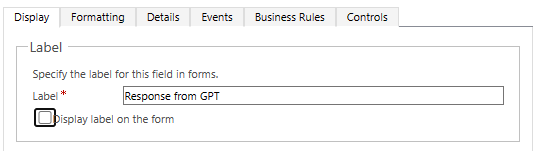

# How to install and configure OpenAI GPT Assisted Column

## Prerequisite

- You have an OpenAI account in order to get API key.  
- You have a Dataverse environment for which you can customize.  
- You have a model-driven app.  

## Installation and configuration

1. Install the solution

    Install the solution file which includes the PCF control to your Dataverse or Dynamics 365 environment.  
    You can download the latest managed solution file (.zip) [here in this repository](https://github.com/keijiinouehotmail/OpenAIGPTAssistedColumnPCF/releases).

1. Creating new column

    This is optional step if you have a column which can be applied, but recommended one.  

    - Create new column in desired table such as the following.

        - *Data type** should be "Multiple lines of text".
        - **Format** should be "Text".
        - You can increase **Maximum character count**.

        

1. Adding the column

    - Add the column you created to a form of your model-driven app in Form Designer in Power Apps

1. Configure the PCF control
    1. Go to the classic Form Designer in Power Apps
    1. Double click the field (or column) which you added above to show the "Field Properties" dialog
    1. Click "Controls" tab
    1. Click "Add Control..." link
    1. Scroll down to find "**OpenAIGPTAssistedColumn**" and click it

        

    1. Click "Add" button
    1. Turn on for Web, Phone, Tablet for your usage

        

    1. Set three properties:
        1. **Keyword**

            This is for a keyword used in Query sentence later.  
            Bind to a value on a field as you want such as **name** ("Account Name" column)  

            

        1. **Query sentence**

            This is for a query sentence for GPT.  
            You can change the default value for your usage.  
            Use ${} as a placeholder to represent the text of the **Keyword** field you set above.  

            - Default value: "What is strengths of **${}** as a company?"
            - The query sentence for GPT will be: "What is strengths of **Microsoft** as a company?", when Keyword is set as "name" in account table and the value is "Microsoft".

            

        1. **API key for OpenAI API**

            This is a API Key for OpenAI API of your OpenAI account.  
            You can generate API Key in the following page.  
                <https://platform.openai.com/account/api-keys>  

            

        1. Now setting of three properties was completed

    1. You can turn "**Display label on the form**" off in "Display" tab

        

    1. Click "OK" button to close "Field Properties" dialog
    1. **Save** and **Publish** the form

1. Open a form on which you added the control of a model-driven app, and check the control's behavior
